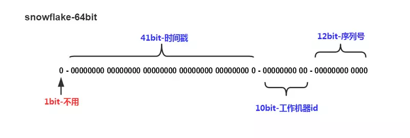

# snowflake

Snowflake is a network service for generating unique ID numbers at high scale with some simple guarantees.

### Goal

- [x] developing a `c` library package.
- [ ] quickly use as a CLI appliction.
- [ ] extension to `lua`.
- [ ] extension to `go`.

### Generation process

Each time you generate an ID, it works, like this.

* A `timestamp` with millisecond precision is stored using 41 bits of the ID.
* Then the `machineID` is added in subsequent bits.
* Then the `counter` is added, starting at 0 and incrementing for each ID generated in the same millisecond. If you generate enough IDs in the same millisecond that the sequence would roll over or overfill then the generate function will pause until the next millisecond.

### References

* [twitter-snowflake](https://github.com/twitter-archive/snowflake)
* thanks to [bwmarrin/snowflake](https://github.com/bwmarrin/snowflake)